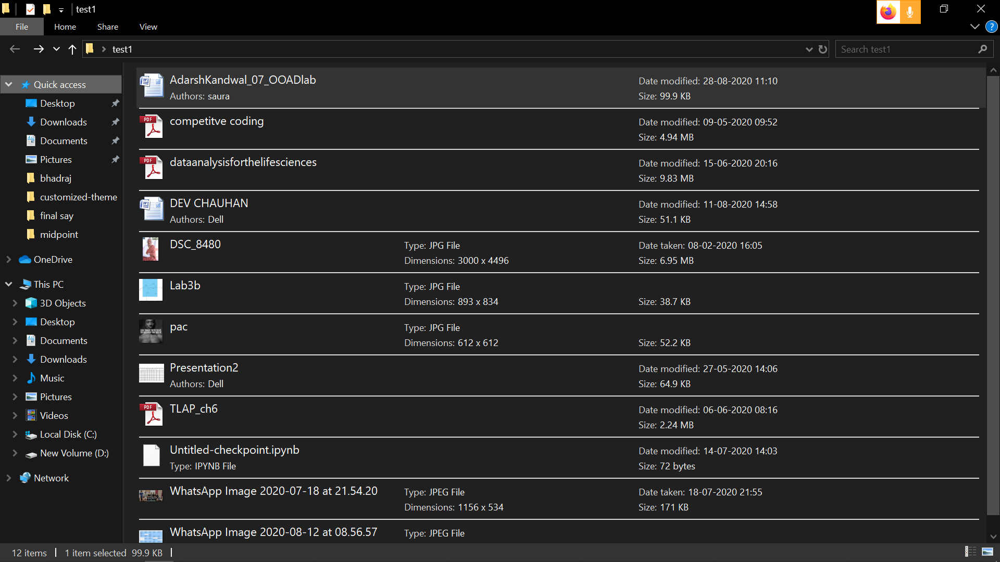
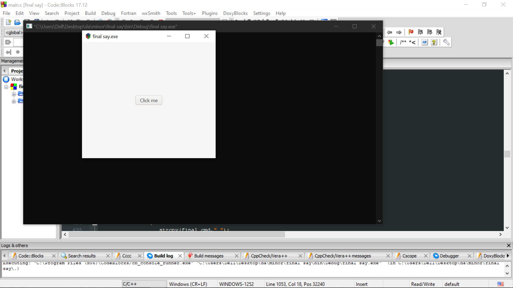

# Folder-Categorization 
Categorization of files and folder based on content and type in c

<h2>1. Target folder </h2> 

<h2>2. The Graphic pannel </h2> 

<h2>3. Selecting file using GtkMM </h2> 

<h2>4. The Results </h2> 

